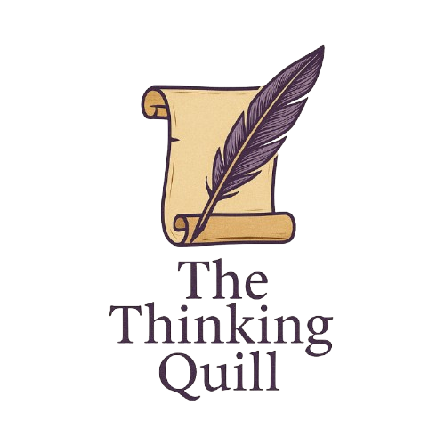

# 🪶 The Thinking Quill

**Essays in Literature, History & the World Beyond the Page**  
A static blog website dedicated to thoughtful writing, deep reading, and cultural insight.



---

## 🌐 Live Site

👉 [Visit the blog](https://sinankodur.github.io/the-thinking-quill/)

---

## 📁 Project Structure

```
the-thinking-quill/
├── index.html                # Homepage
├── about.html               # About the blog
├── posts.html               # Articles/Essays index page
├── subscribe.html           # Newsletter/Subscription page
├── posts/                   # Individual blog posts
│   ├── gabriel-garcia-marquez.html
│   └── reading-homer-in-modern-times.html
├── assets/                  # Static assets (images, CSS, JS)
│   └── images/, css/, js/
├── sitemap.xml              # Sitemap for search engines
└── robots.txt               # Robots and crawling config
```

---

## 🧠 Features

- ✍️ **Static blog** with beautiful typography and serif aesthetics  
- 🌙 **Dark/Light mode toggle** using Tailwind CSS  
- 📖 **Essays in Literature, History, and Global Thought**  
- 🔍 SEO-optimized pages with custom meta tags  
- 🗺️ Sitemap and `robots.txt` included for search indexing  
- 📱 Fully responsive layout  

---

## 🚀 Hosting via GitHub Pages

GitHub Pages will auto-deploy from the `main` branch root.

---

## 🔧 Technologies Used

- **HTML5**
- **Tailwind CSS** – For clean, responsive, minimalist styling
- **GitHub Pages** – Free static hosting

---

## 📬 Contributing

This is currently a personal blog project. If you have suggestions or feedback, feel free to open an issue or reach out.

---

## 📝 License

This project is licensed under the [MIT License](LICENSE).
